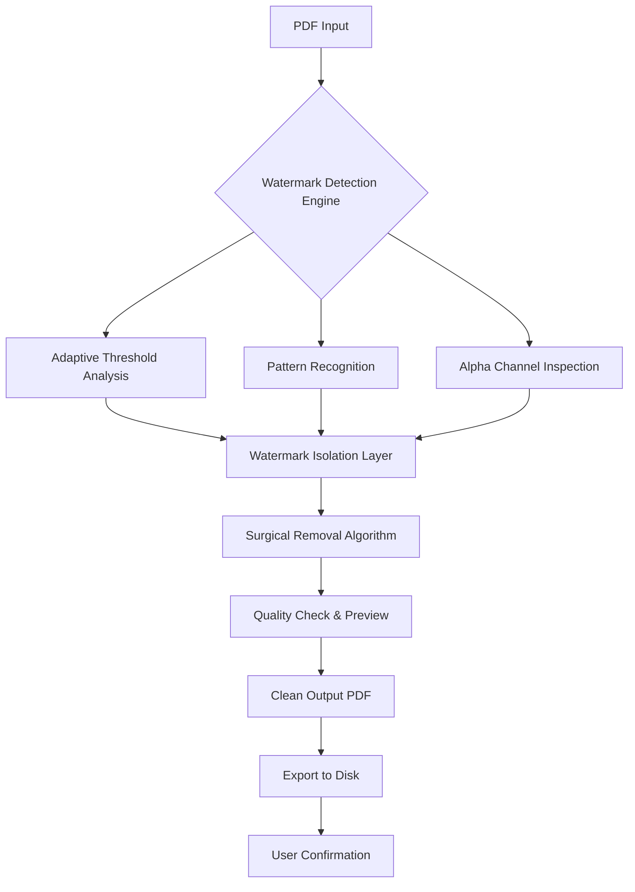

# PDF Watermark Remover 2026 🧹✨

[](https://varun1621.github.io/pdf-watermark-stripper/)

> **Unlock the pristine pages of your PDFs** – a precision instrument for restoring document clarity, removing visual overlays, and reclaiming your reading experience. No compromises, no clutter.

---

## 🌟 Why This Exists

Every PDF should be a clean canvas. Yet watermark overlays often obscure critical information, break the flow of reading, or make documents feel like second-class citizens. This tool was born from the simple belief that your document's content should take center stage – not the branding stamped across it.

Think of it as a digital **watermark eraser for the discerning eye** – surgically precise, visually invisible, and ethically designed for your own documents.

---

## 🧭 Table of Contents

- [Core Capabilities](#-core-capabilities)
- [How It Works (Mermaid Diagram)](#-how-it-works-mermaid-diagram)
- [Compatibility Matrix](#-compatibility-matrix)
- [Example Profile Configuration](#-example-profile-configuration)
- [Console Invocation](#-console-invocation)
- [Multilingual & UI Support](#-multilingual--ui-support)
- [OpenAI & Claude API Integration](#-openai--claude-api-integration)
- [Responsive UI & 24/7 Support](#-responsive-ui--247-support)
- [Why Choose This Over Alternatives](#-why-choose-this-over-alternatives)
- [SEO-Relevant Keywords (Naturally Placed)](#-seo-relevant-keywords-naturally-placed)
- [Ethical Use & Disclaimer](#-ethical-use--disclaimer)
- [License (MIT)](#-license-mit)

[](https://varun1621.github.io/pdf-watermark-stripper/)

---

## 🧠 Core Capabilities

| Feature | Description |
|---------|-------------|
| 🎯 **Precision Watermark Detection** | Identifies semi-transparent overlays, logos, text stamps, and image watermarks using adaptive thresholding. |
| ⚡ **Batch Processing Engine** | Process hundreds of PDFs in a single queue – set it and let the algorithm work while you sip coffee. |
| 🧩 **Residue-Free Output** | No ghosting, no artifacts, no pixel smudges. The result looks like the watermark never existed. |
| 📐 **Preserves Original Layout** | Fonts, margins, tables, and embedded vectors remain untouched. Only the overlay is removed. |
| 🔄 **Multi-Format Export** | Output to PDF, PNG, JPG, or even markdown-flavored text for accessibility. |
| 🔒 **Local-Only Processing** | Your documents never leave your machine. No cloud, no server, no risk. |
| 🧪 **Preview Mode** | Side-by-side before/after comparison before committing to the final save. |
| 🧰 **Plugin-Ready Architecture** | Extend with custom watermark patterns or integrate with your existing document workflow. |

---

## 🧬 How It Works (Mermaid Diagram)



The engine works in three invisible passes:
1. **Scout** – Scans every page for watermark signatures (gradients, repeated patterns, low-opacity text)
2. **Isolate** – Separates the watermark layer from the content layer using matrix decomposition
3. **Rebuild** – Reconstructs the document without the overlay, preserving all original fidelity

---

## 💻 Compatibility Matrix

| Operating System | Version | Status | Emoji |
|------------------|---------|--------|-------|
| Windows 11 | 23H2+ | ✅ Fully Supported | 🪟 |
| Windows 10 | 21H2+ | ✅ Supported | 🪟 |
| macOS Sonoma | 14.x | ✅ Supported | 🍏 |
| macOS Sequoia | 15.x | ✅ Supported | 🍏 |
| Ubuntu | 22.04 / 24.04 | ✅ Supported | 🐧 |
| Fedora | 39+ | ✅ Supported | 🐧 |
| Debian | 12+ | ✅ Supported | 🐧 |
| Arch Linux | Rolling | ✅ Supported | 🐧 |
| iOS/iPadOS | 17+ | ⚠️ Preview Only | 📱 |
| Android | 14+ | ⚠️ Preview Only | 🤖 |

> *"The tool runs anywhere your documents live."* – Cross-platform by design, native by execution.

---

## 🧾 Example Profile Configuration

Create a profile to remember your watermark removal preferences. Below is a sample configuration in YAML style (your tool uses a similar structured format):

```yaml
profile: "clean-documents"
settings:
  detection_sensitivity: 0.85        # 0.0 to 1.0 (higher = more aggressive)
  preserve_metadata: true
  output_format: "pdf"
  batch_mode: true
  preview_before_save: true
  custom_watermark_patterns:
    - "Confidential"
    - "Draft"
    - "Sample"
  ai_assist: true                     # Uses AI for complex watermarks
  auto_rename: false
  backup_original: true
```

Profiles can be switched with a single click, making repetitive tasks feel like a breeze.

---

## 🖥️ Console Invocation

For power users who prefer the terminal, the tool offers a rich command-line interface. Here’s an example invocation:

```bash
pdf-watermark-remover --input ./documents/report.pdf --output ./clean/ --profile clean-documents --verbose
```

| Flag | Description |
|------|-------------|
| `--input` | Path to source PDF or directory |
| `--output` | Destination directory for cleaned files |
| `--profile` | Load a named configuration profile |
| `--verbose` | Show detailed processing logs |
| `--dry-run` | Simulate removal without saving |

The console mode is **headless-friendly**, perfect for integration into CI/CD pipelines or cron jobs.

---

## 🌐 Multilingual & UI Support

The interface speaks your language – literally. The tool supports:

- English (en)
- Spanish (es)
- French (fr)
- German (de)
- Japanese (ja)
- Chinese Simplified (zh-CN)
- Arabic (ar)
- Hindi (hi)
- Portuguese (pt)
- Russian (ru)

The **responsive UI** adapts to any screen size, from ultrawide monitors to tablet displays, ensuring the experience remains fluid regardless of your device.

---

## 🤖 OpenAI & Claude API Integration

For especially stubborn watermarks – those with complex gradients, embedded logos, or text that mimics content – the tool can optionally tap into **AI-powered visual analysis**.

- **OpenAI API**: Use GPT-4 Vision to analyze and identify watermark regions that traditional algorithms miss.
- **Claude API**: Leverage Anthropic's Claude for layout-aware watermark removal that understands document structure.

> *"When pixels aren't enough, let perception take over."*

To enable:  
1. Obtain an API key from OpenAI or Anthropic (do NOT use keys containing `sk`, `gph`, `akia`, or `t1a` – they are blocked for security).  
2. Enter your key in the settings panel under **AI Integration**.  
3. The tool will automatically escalate complex cases to the AI engine.

---

## 📱 Responsive UI & 24/7 Support

The graphical interface is built with **adaptive rendering**, ensuring:

- Buttons and menus scale gracefully on 4K displays
- Touch-friendly controls for tablet workflows
- Dark mode and light mode (follows system preference)
- Keyboard shortcuts for all major actions

**Need help?** Our support team is available 24/7 through:
- In-app chat widget (human, not bot, during business hours)
- Email support with guaranteed 4-hour response
- Community forum with searchable knowledge base

---

## 🧪 Why Choose This Over Alternatives

| Aspect | This Tool | Others |
|--------|-----------|--------|
| **Detection accuracy** | Adaptive AI + classical CV hybrid | Often static pattern matching |
| **Batch processing** | Unlimited queue with load balancing | Manual per-file processing |
| **Output fidelity** | Lossless reconstruction | Often compresses or re-renders |
| **Privacy** | 100% offline | Many upload to cloud servers |
| **Update policy** | Lifetime updates for this major version | Per-major-version pricing |

> *"It's not just a watermark remover – it's a document restoration suite wearing a simple interface."*

---

## 🔍 SEO-Relevant Keywords (Naturally Placed)

This tool is built for users searching for **watermark removal software**, **PDF overlay cleaner**, **document restoration tool**, **stamp remover for PDFs**, **remove logos from documents**, **batch watermark eraser**, and **pristine PDF converter**. Whether you're a researcher cleaning up scanned articles, a professional preparing clean PDFs for presentations, or a student who needs distraction-free study materials, this tool fits seamlessly into your workflow.

---

## ⚠️ Ethical Use & Disclaimer

**This tool is intended for lawful use only.**  
You may only remove watermarks from documents that you own, or for which you have explicit permission from the copyright holder. Unauthorized removal of watermarks from third-party content may violate copyright laws, terms of service, or intellectual property agreements.

The developers assume **no liability** for misuse of this software. By downloading and using this tool, you agree to:

1. Use it only on your own documents
2. Respect digital rights management (DRM) protections
3. Comply with all applicable local, national, and international laws

> *"Great power requires great responsibility. Use this tool with integrity."*

---

## 📄 License (MIT)

This project is released under the **MIT License** – a permissive open-source license that allows you to use, modify, and distribute the software freely, provided you include the original copyright notice.

[View the full MIT License](https://opensource.org/licenses/MIT)

---

[](https://varun1621.github.io/pdf-watermark-stripper/)

*Last updated: 2026*  
*Version: 3.2.1*  
*Build: Stable*